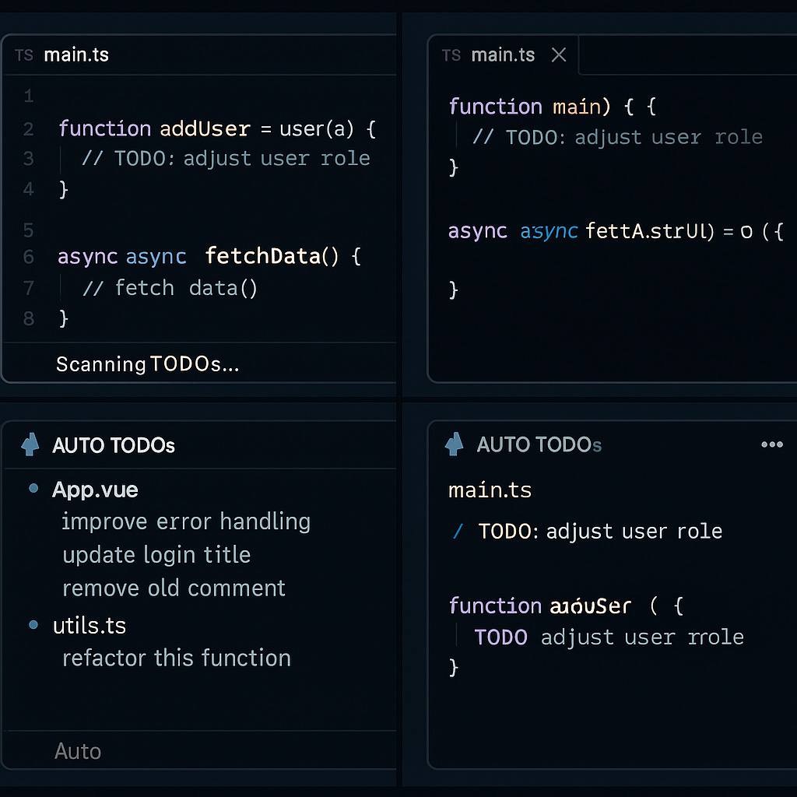

# Auto TODO Manager

Effortlessly detect, organize, and track all TODO comments in your project — fully automated.

Auto TODO Manager scans your entire workspace for TODO-style comments (TODO, FIXME, BUG, HACK, NOTE), builds a clean sidebar tree, and keeps everything up-to-date as you work.

Perfect for developers who want a clean, centralized, and automated way to track pending tasks.

---

## Screenshots



*The sidebar view showing all TODOs organized by file*


---

## Features

- **Automatic detection** of TODO, FIXME, BUG, HACK, NOTE  
- **Tree view sidebar** grouped by files  
- **Live updates** on file save, create, or delete  
- **Quick navigation** — click any TODO to jump to the exact line  
- **Configurable keywords** and file patterns  
- **Zero configuration required** — works out of the box  
- Future: auto-warning for outdated TODOs  
- Future: assign TODOs to team members  
- Future: daily reminders panel  

---

## Quick Start

1. **Install the extension** from the VSCode marketplace
2. **Open your workspace** — the extension automatically scans for TODOs
3. **View TODOs** in the sidebar under "Auto TODOs"
4. **Click any TODO** to navigate directly to its location

---

## Usage Examples

### Basic TODO Comments

The extension detects various comment formats:

```typescript
// TODO: Refactor this function to use async/await
function fetchData() {
  // implementation
}

// FIXME: Memory leak in event listeners
window.addEventListener('click', handler);

// BUG: This doesn't handle null values correctly
const result = data.map(item => item.value);

// HACK: Temporary workaround for API limitation
const response = await fetch(url).catch(() => mockData);

// NOTE: This algorithm is O(n log n) complexity
function sortArray(arr) {
  // implementation
}
```

### Vue Component Example

The extension works with Vue single-file components:

```vue
<template>
  <!-- TODO: Add loading state for async data -->
  <div v-if="loading">Loading...</div>
</template>

<script>
export default {
  // FIXME: This should use computed property instead of method call
  methods: {
    // BUG: This doesn't handle null values correctly
    processData(data) {
      return data.map(item => item.value);
    }
  }
}
</script>

<style scoped>
/* HACK: Temporary workaround for styling issue */
.container {
  padding: 20px;
}
</style>
```

### Supported Comment Styles

Works with different comment syntaxes:

```javascript
// TODO: Single line comment
/* TODO: Block comment */
# TODO: Python/Script comment
<!-- TODO: HTML comment -->
```

### Custom Keywords

You can configure custom keywords in your VSCode settings:

```json
{
  "autoTodoManager.keywords": ["TODO", "FIXME", "BUG", "HACK", "NOTE", "REVIEW", "OPTIMIZE"]
}
```

### Custom File Patterns

Configure which files to scan:

```json
{
  "autoTodoManager.globPatterns": [
    "**/*.ts",
    "**/*.tsx",
    "**/*.js",
    "**/*.jsx",
    "**/*.vue",
    "**/*.py",
    "**/*.go"
  ]
}
```

---

## Configuration

### Settings

| Setting | Type | Default | Description |
|---------|------|---------|-------------|
| `autoTodoManager.keywords` | `string[]` | `["TODO", "FIXME", "BUG", "HACK", "NOTE"]` | Keywords used to detect reminders in code |
| `autoTodoManager.globPatterns` | `string[]` | `["**/*.ts", "**/*.tsx", "**/*.js", "**/*.jsx", ...]` | File patterns scanned for TODOs |

### Commands

- **Auto TODO Manager: Rescan TODOs** — Manually refresh the TODO list

---

## Use Cases

### Personal Projects
Track your own pending tasks and improvements as you code.

### Team Collaboration
Share TODO comments in code reviews and track technical debt.

### Code Reviews
Quickly identify areas that need attention during code reviews.

### Technical Debt Management
Organize and prioritize technical improvements across your codebase.

---

## Development

### Building from Source

```bash
# Clone the repository
git clone https://github.com/heberalmeida/auto-todo-manager.git
cd auto-todo-manager

# Install dependencies
npm install

# Compile TypeScript
npm run compile

# Watch for changes
npm run watch
```

### Project Structure

```
auto-todo-manager/
├── src/
│   ├── extension.ts      # Main extension entry point
│   ├── todoTree.ts       # Tree view data provider
│   └── images/           # Extension icons and screenshots
├── package.json          # Extension manifest
├── tsconfig.json         # TypeScript configuration
└── README.md            # This file
```

---

## Contributing

Contributions are welcome! Please feel free to submit a Pull Request.

1. Fork the repository
2. Create your feature branch (`git checkout -b feature/amazing-feature`)
3. Commit your changes (`git commit -m 'Add some amazing feature'`)
4. Push to the branch (`git push origin feature/amazing-feature`)
5. Open a Pull Request

---

## License

This project is licensed under the MIT License.

---

## Acknowledgments

- Built with [VSCode Extension API](https://code.visualstudio.com/api)
- Inspired by the need for better TODO management in development workflows

---

## Roadmap

- [ ] Age-based TODO warnings (flag old TODOs)
- [ ] TODO assignment to team members
- [ ] Daily reminder notifications
- [ ] Export TODOs to markdown/JSON
- [ ] Filter by keyword type
- [ ] Search functionality
- [ ] TODO statistics dashboard
- [ ] Integration with issue trackers

---

## Support

If you encounter any issues or have suggestions, please [open an issue](https://github.com/heberalmeida/auto-todo-manager/issues) on GitHub.

---

Made with care for developers who value code quality
